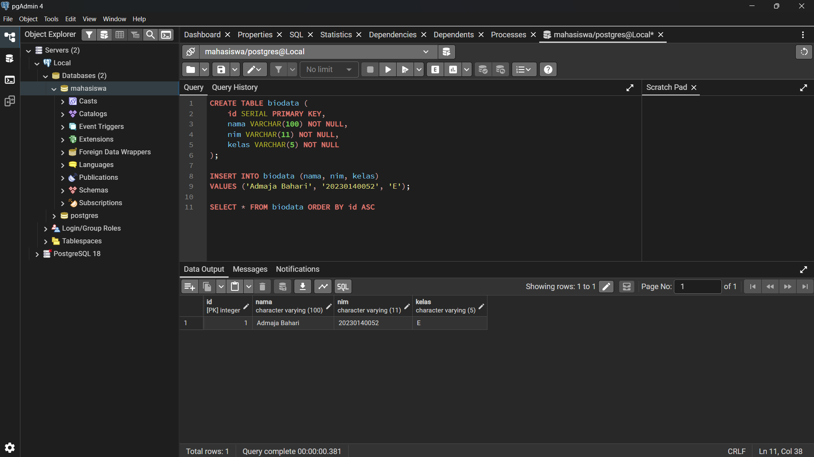
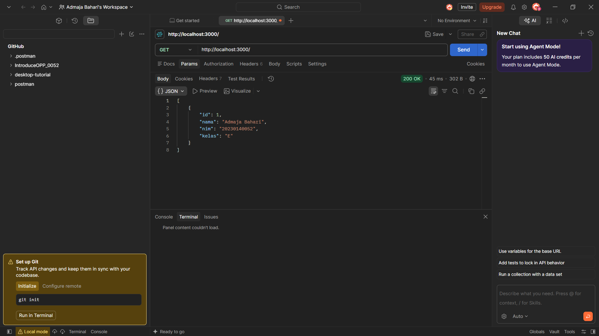

# 052_ConnectionDb

Program Express.js yang terhubung ke database PostgreSQL dan mengambil data dengan method **GET** dari tabel `biodata`.

## Teknologi

- Node.js
- Express.js
- PostgreSQL (`pg`)
- pgAdmin 4 dan Postman

## Struktur Database

- Database: `mahasiswa`
- Tabel: `biodata`

| Kolom | Tipe         | Keterangan  |
|-------|--------------|-------------|
| id    | SERIAL       | Primary key |
| nama  | VARCHAR(100) | NOT NULL    |
| nim   | VARCHAR(11)  | NOT NULL    |
| kelas | VARCHAR(5)   | NOT NULL    |

Perintah SQL yang dipakai:

```sql
CREATE TABLE biodata (
    id SERIAL PRIMARY KEY,
    nama VARCHAR(100) NOT NULL,
    nim VARCHAR(11) NOT NULL,
    kelas VARCHAR(5) NOT NULL
);

INSERT INTO biodata (nama, nim, kelas)
VALUES ('Admaja Bahari', '20230140052', 'E');
```

## Cara Menjalankan

1. Clone repository ini:
   ```bash
   git clone https://github.com/AdmajaBahari/052_ConnectionDb.git
   cd 052_ConnectionDb
   ```
2. Buat database `mahasiswa` dan tabel `biodata` di PostgreSQL (lihat SQL di atas).
3. Sesuaikan konfigurasi koneksi (`user`, `password`, `port`) pada `index.js`.
4. Install dependency lalu jalankan server:
   ```bash
   npm install
   node index.js
   ```
5. Server berjalan di `http://localhost:3000`.

## Endpoint

| Method | URL                      | Keterangan                                |
|--------|--------------------------|-------------------------------------------|
| GET    | `http://localhost:3000/` | Mengambil semua data dari tabel `biodata` |

## Screenshot


